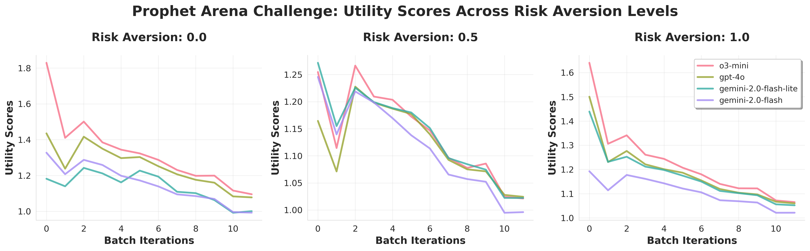

## 🏅 *PM-RANK* - An Analysis Toolkit for Prediction Markets

<!-- This is a repo that contains the code to scrape the prediction market data from *Good Judgement Open* [GJO](https://goodjudgement.org/), interface with our own LLM prediction market (TBD), and analyze (estimation & ranking) the forecasters/predictors. -->

### 📝 1. Introduction

*PM-RANK* is a playground for applying & testing with **diverse methods for scoring and ranking prediction market results**, which can come from either **human or LLM** forecasting data. Currently, we support two types of prediction market data:

- [Good Judgement Open `GJO`](https://goodjudgement.org/): a platform for human forecasting challenges. We provide a crawler to scrape (see below) the `GJO` challenges into the desirable format. Each `GJO` challenge data consists of a <ins>metadata file</ins> specifying the problems (e.g. what are the options), as well as a <ins>predictions file</ins> specifying the predictions made by the forecasters.

- [Prophet Arena `Prophet`](https://prophetarena.com/): a platform for LLM forecasting challenges. Given a <ins>full prediction dataset</ins>, we automatically process the metadata as well as the individual prediction entries.

Regardless of the data source, we provide a **unified interface** to load the data into the following data structures (which allow great scalabilities for other types of prediction market data).

<details>
<summary>&nbsp; Example Data Files</summary>

- For `GJO` challenges, we have the following files:
  - `data/gjo_challenge_metadata.json`: the metadata file for the `GJO` challenge
  - `data/all_predictions.json`: the predictions file for the `GJO` challenge

- For `Prophet` challenges, a single file is needed:
    - `data/prophet_arena_full.csv`
</details>

#### 1.1: &nbsp; Unified Data Interface and Concepts

> Please refer to `data/base.py` for the actual data model implementation. We give a high-level and non-comprehensive overview in a **bottom-up** manner.

1. `ForecastEvent`: this is the most atomic unit of prediction market data. It represents a single prediction made by a forecaster for a single forecast problem. 

    <details>
    <summary>&nbsp; Key Fields in <code>ForecastEvent</code></summary>

    - `problem_id`: an unique identifier for the problem
    - `username`: an unique identifier for the forecaster
    - `timestamp`: the timestamp of the prediction. Note that this is not optional as we might want to **stream** the predictions in time. However, if the original data does not contain this information, we will use the current time as a placeholder.
    - `probs`: the probability distribution over the options -- given by the forecaster.
        - `correct_prob`: the probability assigned to the correct answer.

    </details>
<br>

2. `ForecastProblem`: this is a collection of `ForecastEvent`s for a single forecast problem. It validates keeps track of metadata for the problem like the options and the correct option. It is also a handy way to organize the dataset as we treat `ForecastProblem` as the basic unit of **streaming prediction market data**.


    In particular, if a `ForecastProblem` has the `odds` field, we would answer questions like "how much money can an individual forecaster make" and use these results to rank the forecasters. See `model/market_earning.py` for more details.

    <details>
    <summary>&nbsp; Key Fields in <code>ForecastProblem</code></summary>

    - `title`: the title of the problem
    - `problem_id`: the id of the problem
    - `options`: the options for the problem
    - `correct_option`: the correct option
    - `forecasts`: the forecasts for the problem
    - `num_forecasters`: the number of forecasters
    - `url`: the URL of the problem
    - `odds` (optional): the market odds for each option
    </details>

<br>

3. `ForecastChallenge`: this is a collection of `ForecastProblem`s . It implements two **core functionalities for all scoring/ranking methods** to use:

    - `get_problems -> List[ForecastProblem]`: return all the problems in the challenge. Suitable for the *full-analysis* setting.
    - `stream_problems -> Iterator[List[ForecastProblem]]`: return the problems in the challenge in a streaming setting. This setting **simulates the real-world scenario** where the predictions enter gradually. The scoring/ranking methods can also leverage this function to efficiently calculate the metrics at different time points (batches).


#### 1.2: &nbsp; File Structure

- `crawler/`: contains the code to scrape the prediction market data from GJO
- `data/`: contains the datasets as well as the data structure codes
- `model/`: contains the scoring/ranking methods
- `plotting/`: contains the plotting code for the analysis results
- `test/`: contains the testing code for our data and models

---
### 📊 2. Scoring & Ranking Models

#### 2.1: &nbsp; Roadmap & Todos

#### Models:

- [x] Basic scoring rules: Brier score, Log score, etc.
- [x] Market earning model: directly evaluate how much money an individual forecaster can make (requires the `odds` field in the `ForecastProblem`)
- [ ] Bradley-Terry (BT) type pairwise comparison models, including Elo rating
- [ ] Item response theory (IRT) models
- [ ] For all models, configuration files to specify hyperparameters

#### Diagnostics:

- [ ] Calculate the correlation between different scoring/ranking methods
- [ ] For BT-model, calculate a "graph-connectivity" metric to assess the suitability of the model

#### 2.2: &nbsp; Implemented Models

1. **Scoring Rules** `model/scoring_rule.py`: utlize proper scoring rules to score and rank the forecasters. Some scoring rule (e.g. log) only requires the probability assigned to the correct option, while others (e.g. Brier) requires the full probability distribution.

2. **Market Earning Model** `model/market_earning.py`: calculate the market earning for each forecaster. This model is only applicable when the `odds` field is present in the `ForecastProblem`. In particular, this is a class of models with a hyperparameter `risk_aversion` to uniformly control the risk-taking behavior of the forecasters. For instance, a `risk_aversion=0` represents risk neutrality so we can translate the forecaster's probability distribution into their behavior -- **all-in the most market-undervalued option**. A `risk_aversion=1` then corresponds to a log utility function. 

    An interesting future step, at least for LLM forecasters, is to **ask it to verbalize its own risk-aversion** and use it to calculate the market earning.

#### 2.3: &nbsp; Example: Fitting Streaming Prediction Market Data

In `plotting/plot_crra_risks_curves.py`, we demonstrate a use case of fitting the **market earning model** to the streaming prediction market data. The full dataset is streamed in batches of 100 problems. We then fit **three** market earning model at different risk-aversion levels (0, 0.5, 1). The results are shown in the following figure:



*PM-RANK*'s modular design makes it easy to conduct such analysis easily.


---

### 🕷️ 3. Scraping Data

#### Step 1:

> See `crawler/scrape_gjo_problem_data.py` for the details.

scrapes the problem data from GJO website using `requests` and `BeautifulSoup`. This step will gives us a metadata JSON file, e.g. `data/xxx_challenge_metadata.json`. Each entry in the metadata JSON file is a problem, with the following structure:

```json
{
    "problem_id": "3940",
    "title": "Who will win the NFL Most Valuable Player Award for the 2024 season?",
    "url": "https://www.gjopen.com/questions/3940-who-will-win-the-nfl-most-valuable-player-award-for-the-2024-season",
    "metadata": {
        "status": "Closed",
        "end_date": "2025-02-07T03:40:25Z",
        "num_forecasters": 61,
        "num_forecasts": 147
    },
    "options": [
        "Josh Allen",
        "Saquon Barkley",
        "Sam Darnold",
        "Jared Goff",
        "Lamar Jackson",
        "Someone else"
    ],
    "correct_answer": "Josh Allen"
}
```

#### Step 2:

> See `crawler/scrape_gjo_predictions_data.py` for the details.

scrapes the prediction data from GJO website using `Playwright`. This would require the additional installation of `Playwright` browser kernels via `playwright install`. This step will gives us a predictions JSON file, e.g. `data/all_predictions.json`. Each entry in the predictions JSON file is a prediction, with the following structure:

```json
{
    "problem_id": "3940",
    "username": "Jonah-Neuwirth",
    "timestamp": "2025-02-06T05:44:32Z",
    "prediction": [0.2,0.0,0.0,0.0,0.8,0.0]
}
```

The username is an unique identifier for each forecaster. The prediction is a list of probabilities for the options specified in the problem metadata.

> 🔥 Warning: please respect the rate limit of GJO website when scraping any information. Our script does this by adding a random sleep time bewteen the requests.

