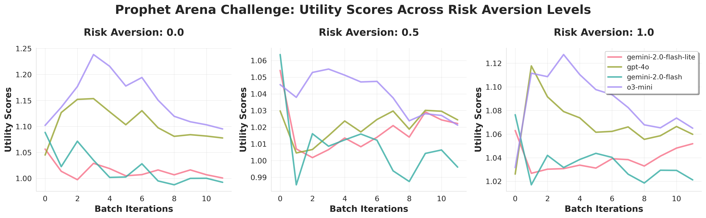
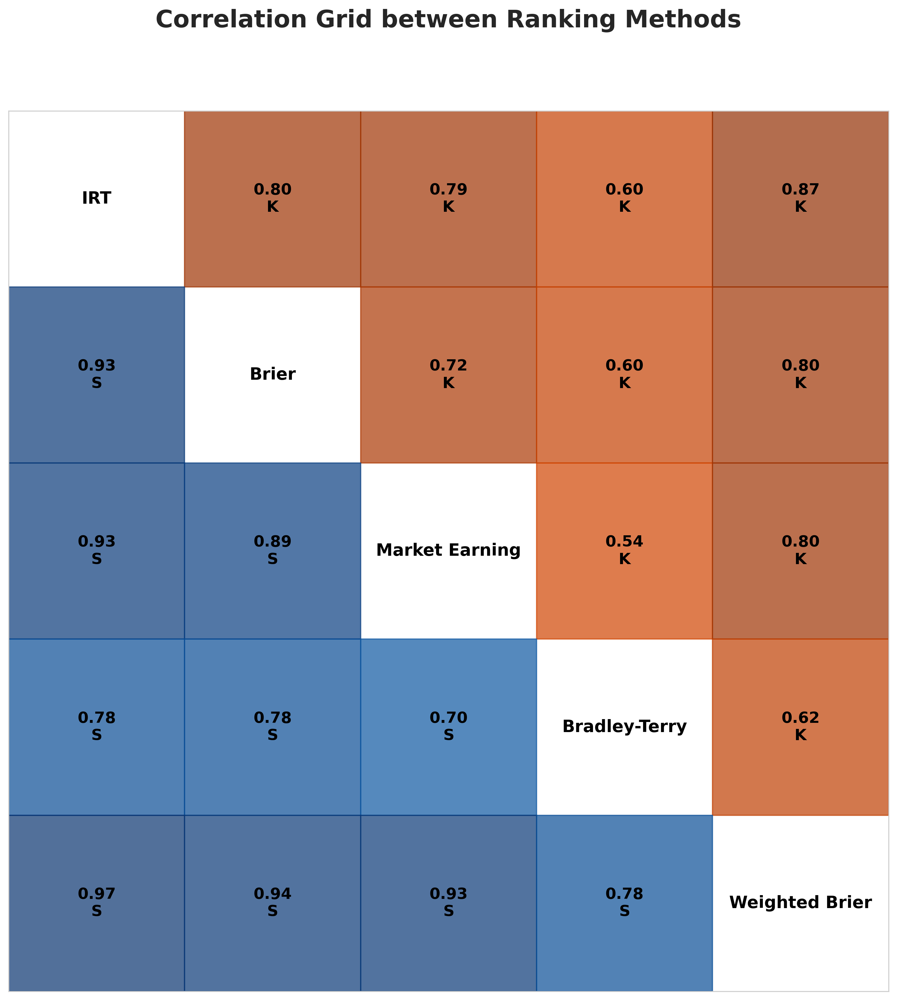

## 🏅 *PM-RANK* - An Analysis Toolkit for Prediction Markets

<!-- This is a repo that contains the code to scrape the prediction market data from *Good Judgement Open* [GJO](https://goodjudgement.org/), interface with our own LLM prediction market (TBD), and analyze (estimation & ranking) the forecasters/predictors. -->

### 📝 1. Introduction

#### 1.1: &nbsp; Installation

**Install from PyPI (recommended):**
```sh
pip install pm-rank
```
this will give you access to most basic scoring/ranking models *except for the IRT model*, which requires `torch>=2.0.0`. To install the full version, run:
```sh
pip install pm-rank[full]
```

If you want to work on the documentation, you can install the `docs` version:
```sh
pip install pm-rank[docs]
```

**Install from source (local build):**
```sh
git clone https://github.com/listar2000/pm_rank.git
cd pm_rank
pip install .
```
Or, for development (editable) mode:
```sh
pip install -e .
```

#### 1.2: &nbsp; Quick Start

The example below builds a tiny challenge in memory and ranks three forecasters with the Brier scoring rule. It runs on a stock `pip install pm-rank` with no external data files:

```python
from datetime import datetime
from pm_rank import (
    ForecastEvent, ForecastProblem, ForecastChallenge,
    BrierScoringRule, GeneralizedBT,
)

now = datetime.now()
options = ["Yes", "No", "Maybe"]

problem1 = ForecastProblem(
    title="Will it rain tomorrow?",
    problem_id="p1",
    options=options,
    correct_option_idx=[0],
    end_time=now,
    num_forecasters=3,
    forecasts=[
        ForecastEvent(forecast_id="f1", problem_id="p1", username="alice",
                      timestamp=now, probs=[0.7, 0.2, 0.1]),
        ForecastEvent(forecast_id="f2", problem_id="p1", username="bob",
                      timestamp=now, probs=[0.4, 0.4, 0.2]),
        ForecastEvent(forecast_id="f3", problem_id="p1", username="carol",
                      timestamp=now, probs=[0.5, 0.3, 0.2]),
    ],
)

problem2 = ForecastProblem(
    title="Will the stock go up?",
    problem_id="p2",
    options=options,
    correct_option_idx=[1],
    end_time=now,
    num_forecasters=3,
    forecasts=[
        ForecastEvent(forecast_id="f4", problem_id="p2", username="alice",
                      timestamp=now, probs=[0.2, 0.6, 0.2]),
        ForecastEvent(forecast_id="f5", problem_id="p2", username="bob",
                      timestamp=now, probs=[0.5, 0.3, 0.2]),
        ForecastEvent(forecast_id="f6", problem_id="p2", username="carol",
                      timestamp=now, probs=[0.3, 0.4, 0.3]),
    ],
)

challenge = ForecastChallenge(title="Demo", forecast_problems=[problem1, problem2])

scores, rankings = BrierScoringRule().fit(challenge.get_problems())
print("Brier scores  :", scores)
print("Brier rankings:", rankings)

bt_scores, bt_rankings = GeneralizedBT().fit(challenge.get_problems())
print("BT skills   :", bt_scores)
print("BT rankings :", bt_rankings)
```

For per-model walkthroughs (Brier / Bradley-Terry / Average Return / Calibration), see the Mintlify docs site.

#### 1.3: &nbsp; Unified Data Interface and Concepts

> Please refer to `src/pm_rank/data/base.py` for the actual data model implementation. We give a high-level and non-comprehensive overview in a **bottom-up** manner.

1. `ForecastEvent`: this is the most atomic unit of prediction market data. It represents a single prediction made by a forecaster for a single forecast problem. 

    <details>
    <summary>&nbsp; Key Fields in <code>ForecastEvent</code></summary>

    - `problem_id`: an unique identifier for the problem
    - `username`: an unique identifier for the forecaster
    - `timestamp`: the timestamp of the prediction. Note that this is not optional as we might want to **stream** the predictions in time. However, if the original data does not contain this information, we will use the current time as a placeholder.
    - `probs`: the probability distribution over the options -- given by the forecaster.
    - `unnormalized_probs`: the unnormalized probability distribution over the options -- given by the forecaster.
    - `odds` (optional): the market odds for each option to realize (resolve to `YES`)
    - `no_odds` (optional): the market odds for each option to not realize (resolve to `NO`)
    </details>

2. `ForecastProblem`: this is a collection of `ForecastEvent`s for a single forecast problem. It validates and keeps track of metadata for the problem like the options and the correct option. It is also a handy way to organize the dataset as we treat `ForecastProblem` as the basic unit of **streaming prediction market data**.


    In particular, if a `ForecastProblem` contains `ForecastEvent`s that have the `odds`/`no_odds` field, we would answer questions like "how much money can an individual forecaster make" and use these results to rank the forecasters. See `src/pm_rank/model/average_return.py` for more details.

    <details>
    <summary>&nbsp; Key Fields in <code>ForecastProblem</code></summary>

    - `title`: the title of the problem
    - `problem_id`: the id of the problem
    - `options`: the options for the problem
    - `correct_option_idx`: the index of the correct option
    - `forecasts`: the forecasts for the problem
    - `num_forecasters`: the number of forecasters
    - `url`: the URL of the problem
    </details>

3. `ForecastChallenge`: this is a collection of `ForecastProblem`s . It implements two **core functionalities for all scoring/ranking methods** to use:

    - `get_problems -> List[ForecastProblem]`: return all the problems in the challenge. Suitable for the *full-analysis* setting.
    - `stream_problems -> Iterator[List[ForecastProblem]]`: return the problems in the challenge in a streaming setting. This setting **simulates the real-world scenario** where the predictions enter gradually. The scoring/ranking methods can also leverage this function to efficiently calculate the metrics at different time points (batches).


#### 1.4: &nbsp; File Structure

- `src/pm_rank/crawler/`: contains the code to scrape the prediction market data from GJO
- `src/pm_rank/data/`: contains the data structure codes and loaders
- `src/pm_rank/model/`: contains the scoring/ranking methods
- `src/pm_rank/plotting/`: contains the plotting code for the analysis results
- `test/`: contains the testing code for our data and models

---
### 📊 2. Scoring & Ranking Models

#### 2.1: &nbsp; Implemented Features

**Models:**

- Basic scoring rules: Brier score, Log score, Spherical score
- Market earning model: directly evaluate how much money an individual forecaster can make (requires the `odds`/`no_odds` field in the `ForecastProblem`)
- Bradley-Terry (BT) type pairwise comparison models, including Elo rating
- Item Response Theory (IRT) models

**Diagnostics:**

- Calibration (Expected Calibration Error)
- Correlation between different scoring/ranking methods (Spearman, Kendall)

#### 2.2: &nbsp; Implemented Models

1. **Scoring Rules** `src/pm_rank/model/scoring_rule.py`: utilize proper scoring rules to score and rank the forecasters. Some scoring rules (e.g. log) only require the probability assigned to the correct option, while others (e.g. Brier) require the full probability distribution.

2. **Market Earning Model** `src/pm_rank/model/average_return.py`: calculate the market earning for each forecaster. This model is only applicable when the `odds` field is present in the `ForecastProblem`. In particular, this is a class of models with a hyperparameter `risk_aversion` to uniformly control the risk-taking behavior of the forecasters. For instance, a `risk_aversion=0` represents risk neutrality so we can translate the forecaster's probability distribution into their behavior -- **all-in the most market-undervalued option**. A `risk_aversion=1` then corresponds to a log utility function.

    An interesting future step, at least for LLM forecasters, is to **ask it to verbalize its own risk-aversion** and use it to calculate the market earning.

3. **Generalized Bradley-Terry Model** `src/pm_rank/model/bradley_terry.py`: Implements the Generalized Bradley-Terry (GBT) model for ranking forecasters based on their pairwise performance across prediction problems. The GBT model estimates a 'skill' parameter for each forecaster by comparing their probability assignments to the correct outcome, iteratively updating these skills to best explain the observed outcomes. This approach is particularly useful for settings where direct pairwise comparisons between forecasters are meaningful.

4. **IRT (Item Response Theory) Models** `src/pm_rank/model/irt/`: Provides IRT-based models for ranking forecasters by modeling both forecaster ability and problem difficulty/discrimination. The IRT model uses probabilistic inference (via SVI or MCMC) to estimate latent skill parameters for each forecaster and latent difficulty/discrimination parameters for each problem, allowing for a nuanced ranking that accounts for the varying challenge of different prediction problems.

5. **Weighted Brier Scoring Rule** `src/pm_rank/model/scoring_rule.py`: Once we have fit an IRT model, we can use the problem-level discrimination parameter to weight the Brier score. The simple way is through

```python
# assume that `irt_model` is already fitted.
problem_discriminations, _ = irt_model.get_problem_level_parameters()
problem_discriminations = np.array([problem_discriminations[problem.problem_id] for problem in problems])
brier_scoring_rule = BrierScoringRule()
brier_ranking_result = brier_scoring_rule.fit(problems, problem_discriminations=problem_discriminations, include_scores=False)
```
Our experiment shows that this weighted metric has the highest rank correlation with the IRT model-based individual skill ranking.

#### 2.3: &nbsp; Example: Fitting Streaming Prediction Market Data

In `src/pm_rank/plotting/plot_crra_risks_curves.py`, we demonstrate a use case of fitting the **market earning model** to the streaming prediction market data. The full dataset is streamed in batches of 100 problems. We then fit **three** market earning models at different risk-aversion levels (0, 0.5, 1). The results are shown in the following figure:



*PM-RANK*'s modular design makes it easy to conduct such analysis.


#### 2.4: &nbsp; Example: Comparing Ranking Metrics and Plotting Correlations

To compare the different ranking metrics, see the code in `src/pm_rank/plotting/plot_correlations_multiple_metrics.py`. This script demonstrates how to compute all implemented ranking metrics (Brier, Market Earning, Generalized Bradley-Terry, IRT, and Weighted Brier) on a dataset and visualize the pairwise correlations between their resulting rankings. The resulting plot, which shows both Spearman and Kendall correlations between all pairs of ranking methods, is shown below:

<p align="center">
  
</p>

---

### 🕷️ 3. Scraping Data

#### Step 1:

> See `src/pm_rank/crawler/scrape_gjo_problem_data.py` for the details.

scrapes the problem data from GJO website using `requests` and `BeautifulSoup`. This step will gives us a metadata JSON file, e.g. `data/xxx_challenge_metadata.json`. Each entry in the metadata JSON file is a problem, with the following structure:

```json
{
    "problem_id": "3940",
    "title": "Who will win the NFL Most Valuable Player Award for the 2024 season?",
    "url": "https://www.gjopen.com/questions/3940-who-will-win-the-nfl-most-valuable-player-award-for-the-2024-season",
    "metadata": {
        "status": "Closed",
        "end_time": "2025-02-07T03:40:25Z",
        "num_forecasters": 61,
        "num_forecasts": 147
    },
    "options": [
        "Josh Allen",
        "Saquon Barkley",
        "Sam Darnold",
        "Jared Goff",
        "Lamar Jackson",
        "Someone else"
    ],
    "correct_answer": "Josh Allen"
}
```

#### Step 2:

> See `src/pm_rank/crawler/scrape_gjo_predictions_data.py` for the details.

scrapes the prediction data from GJO website using `Playwright`. This would require the additional installation of `Playwright` browser kernels via `playwright install`. This step will gives us a predictions JSON file, e.g. `data/all_predictions.json`. Each entry in the predictions JSON file is a prediction, with the following structure:

```json
{
    "problem_id": "3940",
    "username": "Jonah-Neuwirth",
    "timestamp": "2025-02-06T05:44:32Z",
    "prediction": [0.2,0.0,0.0,0.0,0.8,0.0]
}
```

The username is an unique identifier for each forecaster. The prediction is a list of probabilities for the options specified in the problem metadata.

> 🔥 Warning: please respect the rate limit of GJO website when scraping any information. Our script does this by adding a random sleep time bewteen the requests.

