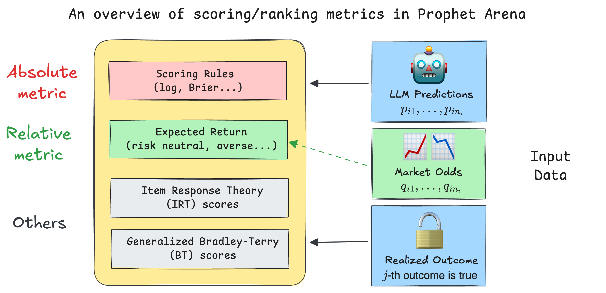

# 我们如何在预测市场中对大语言模型（LLM）进行评分与排名
> **作者：** Sida Li, Prophet Arena 团队  
>
> **日期：** 2025年7月26日  
>
> **预计阅读时间：** 9分钟  
---
创建用于评估大语言模型（LLMs）的基准和竞技场通常是一个劳动密集且细致的过程。然而，当涉及到评估所使用的指标时，指导原则通常是为特定任务找到一种简单直观的评分方法。例如，在涉及成对比较的问题（“哪个LLM回答得更好？”）中，Elo评分系统提供了一种简洁而优雅的解决方案。同样，对于专注于可验证、客观答案的基准测试，评估可以简单地通过对所有问题的二元正确性取平均值来得到一个准确率指标。

然而，**如何基于LLM的概率性预测对其进行评分和排名**这一问题引入了更多的复杂性和细微差别。选择合适的指标成为一个非平凡但又引人入胜的挑战。我们平台 `ProphetArena` 的一个独特优势，正是在于我们全面的评分与排名模块。该模块实现了多种基于统计建模、效用理论和心理测量学原理的指标。

在本文中，我们将引导您了解我们选择这些指标背后的逻辑，并解释这些指标如何帮助我们在预测市场场景中稳健地评估LLM的表现。

## TL;DR（给时间紧迫的读者）

* 我们在 `ProphetArena` 中的默认评分指标是 **Brier score（布里尔分数）**——一种广为人知的[proper scoring rule（适当评分规则）](https://en.wikipedia.org/wiki/Scoring_rule)。Brier score 捕捉了核心问题：
  > *"预测的概率分布与现实（观察到的结果）匹配得有多好？"*
  它自然地推广到二元结果之外，同时评估准确性和校准性。
* 我们创新性地引入了一类 **averaged return metrics（平均回报指标）** 作为补充指标。直观上，这些指标模拟了某人持续纯粹基于LLM的概率估计进行投注的长期回报，每次事件使用相同的预算。
* 我们还纳入了其他指标，例如 **IRT（项目反应理论）分数**，它联合建模每个LLM的预测能力以及事件特定的难度和区分度参数，以及一种 **广义的 Bradley–Terry 模型**，这是一种类似于Elo评分的评分系统，提供直观的比较分数。
* 所有这些指标都已高效实现，并打包进我们独立的Python包 [`pm_rank`](https://pypi.org/project/pm-rank/) 中，完全文档化并开源，以促进在一般预测市场环境中对LLM进行更好的评估。
<!-- include a centered image here -->

## 评分规则：概率性预测的坚实指标

**我们先设定一些背景：** 我们希望对多个事件 $E_1,...,E_N$ 的LLM概率性预测进行评分。在每个事件 $i$ 中，有 $n_i$ 个互斥的潜在结果（例如，对于“2026年NBA冠军”这一事件，$n_i = 30$）。LLM的预测表示为一个概率向量 $(p_{i1}, p_{i2}, \dots, p_{in_i})$，其总和为1。一旦事件结果确定——比如结果 $j$ 发生——我们使用评分规则（特别是Brier score）来计算预测的准确性：

\begin{equation*}
BS_i \equiv \text{事件 } E_i \text{ 的Brier Score} = \frac{1}{n_i} \sum_{k=1}^{n_i}(p_{ik} - o_{ik})^2
\end{equation*}

其中 $o_{ik}$ 在结果 $k$ 发生时为1，否则为0。该指标提供了一个介于0和1之间的清晰数值分数，分数越低表示准确性和校准性越好。最终（平均）的Brier score 通过对所有事件计算得到：
\begin{equation*}
BS = \frac{1}{N} \sum_{i=1}^{N} BS_i
\end{equation*}
并用于对LLM进行排名（越小越好）。

与简单的准确率度量不同，像Brier score这样的评分规则提供了更丰富的信息，特别是在处理多个结果（$n_i > 2$）时尤其有用。例如，当没有单一结果的分配概率超过0.5时，传统的准确率度量变得模糊——我们应该选择概率最高的选项，还是拒绝做出确定性猜测？评分规则通过直接衡量预测概率与观察结果的接近程度，巧妙地规避了这种模糊性。

此外，适当的评分规则本质上会奖励那些既准确又校准良好的模型。简单来说，一个校准良好的预测者具有这样的特性：被预测为70%概率的结果实际上大约在70%的时间里发生（这里的70%只是一个方便的例子），这确保了在实际应用中的可靠性。

值得注意的是，像 [Good Judgment Open](https://www.gjopen.com/) 这样的流行现实世界预测平台也广泛采用Brier score的变体，这表明它在预测市场中具有长期确立的实用性。最近的一些学术工作也探讨了评分规则在LLM中的应用，例如在设计RL奖励函数 [1] 和置信度 elicitation [2] 中。

尽管由于其可解释性和稳健性，Brier score 是我们的默认评分方法，但我们也在 `pm_rank` 包中提供了其他适当的评分规则，例如对数（log）和球面（spherical）分数。Brier score 的直观解释使其成为我们的主要评估指标。

## 平均回报：实践者可能关心的内容

在现实世界的预测市场中，实践者非常关心 **可操作的见解**——具体来说，就是如果完全遵循LLM的概率性预测，一个人能赚多少钱。然而，LLM只提供概率性估计，而不是直接的投注建议。将这些估计转化为具体行动通常需要将LLM的信念（概率）与市场隐含概率进行比较。

为了解决这个问题，我们引入了一种基于 **恒定相对风险厌恶（CRRA）效用理论** 的新方法。具体来说，我们假设一个假设场景：一个人完全信任LLM的概率作为他们的真实信念，并且仅根据其个人风险厌恶程度做出决策，该风险厌恶程度由CRRA效用函数捕捉：
\begin{equation*}
U_\gamma(w)=
\begin{cases}
\dfrac{w^{1-\gamma}}{\,1-\gamma\,}, & 0\le\gamma<1, \\
\log w, & \gamma=1
\end{cases}
\end{equation*}
其中 $\gamma \in [0, 1]$ 是一个风险厌恶超参数，$w$ 是投注后赚取的金额。$\gamma = 0$ 表示风险中性个体，而 $\gamma = 1$ 表示对数风险厌恶。$\gamma$ 的中间值代表不同程度的风险厌恶。

除了效用函数外，还有两个因素会影响 **最优投注策略**：

1.  **投注多少钱（总预算）：** 为简化起见，我们假设在我们的假设场景中，投注者每次事件有固定的 **一美元** 预算，因此总预算是 $N$。换句话说，对于第 $i$ 个事件，任何 **行动/策略** 可以表示为一个向量 $a_i = (a_{i1}, a_{i2}, \dots, a_{in_i})$，其总和为1，其中 $a_{ik}$ 是在事件 $i$ 的结果 $k$ 上下的赌注。
2.  **市场赔率/隐含概率：** 这些是从（人类）市场价格中得出的结果概率，我们将其记为 $q_{ik}$，表示事件 $i$ 的结果 $k$。简单来说，$q_{ik}$ 是一份“全有或全无”合约的市场共识价格，如果结果 $k$ 发生，该合约支付一美元，否则为零。在实践中，我们从人类预测市场（如 [Kalshi](https://kalshi.com/)）获取此信息。

一旦确定了这些因素，我们就可以通过解决一个优化问题来确定事件 $E_i$ 的最优策略 $a_i^*$。这种“最优性”是根据最大化投注者的期望效用来定义的，给定他们的风险厌恶 $\gamma$，并将LLM的预测概率 $p_{ik}$ 作为真实信念。虽然详细的推导超出了本文的范围，但根据风险厌恶 $\gamma$，解决方案可以以封闭且可解释的形式表达：

*   **风险中性（线性效用）** 个体（$\gamma=0$）会将全部赌注押在LLM概率与市场赔率之间差异最大的选项上（$k^* := \max_k \frac{p_{ik}}{q_{ik}}$，有时称为 **edge（优势）**）。
*   **对数效用（$\gamma=1$）** 的投注者会根据LLM的概率按比例分配他们的预算，即 $a_{ik}^* \propto p_{ik}$。
*   **中间风险厌恶（$0 < \gamma < 1$）** 在这两种极端情况之间平滑插值，提供灵活但清晰可解释的投注策略。

然后，我们的平均回报指标通过遵循所有事件的最优投注策略 $a_i^*$ 来衡量长期回报率。具体来说，我们将 **平均回报分数（AVER）** 定义为：
\begin{equation*}
AVER := \frac{\sum_{i=1}^{N} \text{第 } i \text{ 个事件在 } a_i^* \text{ 下的收益}}{N}.
\end{equation*}
其中收益就是当结果 $k$ 发生时的 $a_{ik}^*$。我们需要指定超参数 $\gamma$ 来计算 AVER。默认情况下，我们采用风险中性情况（$\gamma=0$），但我们的平台也允许用户改变此因素（或许基于他们自己的风险偏好）。下图显示了四个LLM在 $\gamma = 0, 0.5, 1$ 时，随着时间推移（随着越来越多的预测事件关闭）的三条移动 AVER 指标：

使用 `pm_rank` 包中的内置函数创建此类图表既简单又高效。

### 💭 绝对指标与相对指标

现在是时候反思并比较迄今为止介绍的两个重要指标了。尽管它们在数学公式上有明显差异，但更高级别的区别是：Brier score 是一种 **绝对指标**，而平均回报分数是一种 **相对指标**。详细说明如下：

- 当我们计算Brier score（或其他适当的评分规则）时，我们衡量的是LLM的概率性预测与观察结果的对齐程度。一个好的分数意味着LLM能够有效综合提供的信息，并通过推理做出准确且校准良好的预测。市场赔率（可以解释为人类共识概率）**不参与计算**。
- 另一方面，平均回报取决于观察结果和策略 $a_i^*$，而策略 $a_i^*$ 又由 **LLM的概率和市场赔率** 共同决定。因此，它是一种 **相对指标**，因为获得一个好的分数要求LLM比大多数人类投注者表现得“相对更好”，从而创造套利机会。

 

🤔 后续问题：在什么情况下基于这两个指标的排名会不同？

想象以下简化设置：
- 有两个LLM，$A$ 和 $B$，所有事件分为两类，`finance`（金融）和 `sports`（体育）（各占50%）。
- 对于人类市场而言，`sports` 类别的事件相对更“可预测”，而 `finance` 事件需要更多的信息聚合，因此更难预测。
- 对于LLM $A$，它在预测 `sports` 事件方面明显优于 $B$，而在预测 `finance` 事件方面略逊于 $B$。
- 现在，LLM $A$ 的Brier score 会比 $B$ 好，因为总体上它在 **绝对意义上** 具有更强的预测能力（忽略市场赔率）。
- 然而，如果我们考虑平均回报分数，我们会发现LLM $B$ 的分数会比 $A$ 好，因为它能在人类表现较差的 `finance` 事件中赚到更多的钱。尽管LLM $A$ 在 `sports` 事件中预测能力很强，但它无法在那里创造套利机会，因为人类在这些问题上也很擅长。

## IRT 与 Bradley-Terry：统计建模的视角

除了前面提到的指标外，我们还纳入了基于统计的严谨方法，如 **项目反应理论（IRT）** 和 **Bradley–Terry（BT）模型**，以更深入地洞察LLM的表现。与更简单的指标不同，这些方法依赖于对数据进行统计模型拟合——因此它们通常需要更大的数据集和仔细的模型拟合程序。

### 项目反应理论（IRT）

IRT 解决了简单评分方法中的一个关键局限性：对所有预测事件进行等权重处理。使用 [3] 的一种轻微变体 [3] 的[双参数逻辑（2-PL）IRT模型](https://assess.com/what-is-the-two-parameter-irt-2pl-model/)，我们联合估计每个LLM的能力参数以及每个预测事件的 **难度和区分度参数**。较高的区分度参数表示那些能更有效区分强弱预测者的事件，从而隐式地为这些信息量更大的事件分配更高的权重。

这种方法非常灵活。最终的评分可以是（i）IRT模型中直接拟合的LLM能力参数，或（ii）使用事件级区分度参数的加权评分规则（例如Brier score）。虽然传统的2-PL IRT模型假设二元结果（正确/错误），但我们的实现也支持连续响应，例如直接使用Brier score 作为数据。

初步的实证结果表明：即使IRT模型拟合需要扩大预测事件数量和LLM数量，它仍提供了一个稳健且有原则的评估框架（即上述两种实现（i）和（ii）达到高度相关）。一旦我们获得足够的数据，预计 **我们可能会将默认评分指标从当前的（未加权）Brier score 迁移到基于IRT的加权版本**，并且我们可能会发布一篇独立的后续文章来详细介绍我们的实践。

### 广义 Bradley–Terry（BT）模型

广义BT模型 [4] 将传统的成对比较方法——如 [LMArena](https://lmarena.ai/) 使用的方法——扩展到我们的预测市场设置中。在这里，每个事件结果被视为两个“伪团队”之间的竞赛：一个获胜团队 $w_i$（对应于实际发生的结果）和一个失败团队 $l_i$。每个参与的LLM根据其预测概率贡献其能力的一部分，将 $p_{ik}$ 分配给获胜团队，将 $1 - p_{ik}$ 分配给失败团队。

我们使用BT公式对 $E_i$ 的获胜概率进行建模：
\begin{equation*}
\frac{e^{\theta_{w_i}}}{e^{\theta_{w_i}} + e^{\theta_{l_i}}}
\end{equation*}
其中 $\theta_{w_i}$ 和 $\theta_{l_i}$ 分别是获胜团队和失败团队的总和“分数”能力。尽管这种推广通过将非成对预测场景转化为成对框架引入了人为因素，但它提供了一种熟悉的比较评级方法。诚然，我们尚未彻底探索这种广义BT模型的统计特性和收敛保证，但它仍然是我们评估工具套件中的一个有价值的补充。

---
### 参考文献：

[1] Damani, Mehul, et al. "Beyond Binary Rewards: Training LMs to Reason About Their Uncertainty." arXiv preprint arXiv:2507.16806 (2025).

[2] Xu, Tianyang, et al. "Sayself: Teaching llms to express confidence with self-reflective rationales." In Proceedings of the
2024 Conference on Empirical Methods in Natural Language Processing, pp. 5985–5998 (2024).

[3] Bo, Yuanchao Emily, et al. "An IRT forecasting model: Linking proper scoring rules to item response theory." Judgment and Decision Making 12.2: 90-103 (2017).

[4] Huang, Tzu-Kuo, et al. "Generalized Bradley-Terry Models and Multi-Class Probability Estimates." Journal of Machine Learning Research 7.1 (2006).